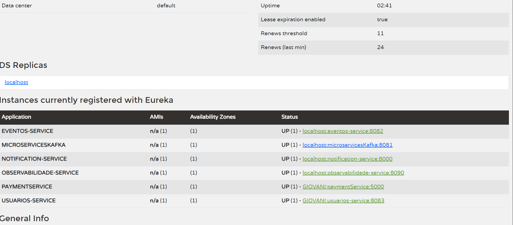

# 🎬 CineLeo - Ecossistema de Microsserviços

Plataforma completa de gerenciamento de cinema desenvolvida com **Java 21**, **Spring Boot 3**, **Spring Cloud Netflix Eureka**, **Apache Kafka** e **PostgreSQL**.

O ecossistema gerencia usuários, filmes, salas, sessões, reservas, pagamentos e notificações, utilizando arquitetura baseada em microsserviços, comunicação assíncrona por eventos e observabilidade centralizada.

---

# 📋 Sumário

* [Visão Geral](#-visão-geral)
* [Arquitetura do Ecossistema](#-arquitetura-do-ecossistema)
* [Microsserviços](#-microsserviços)
* [Tecnologias Utilizadas](#-tecnologias-utilizadas)
* [Pré-requisitos](#-pré-requisitos)
* [Como Executar o Projeto](#-como-executar-o-projeto)
* [Fluxo Principal de Negócio](#-fluxo-principal-de-negócio)
* [Endpoints Consolidados](#-endpoints-consolidados)
* [Observabilidade](#-observabilidade)
* [Segurança e Boas Práticas](#-segurança-e-boas-práticas)
* [Testes](#-testes)
* [Melhorias Futuras](#-melhorias-futuras)
* [Licença](#-licença)

---

# 🔍 Visão Geral

O **CineLeo** é uma plataforma de gestão de cinema construída com arquitetura de microsserviços.

A aplicação permite que usuários:

* Visualizem filmes em cartaz
* Consultem sessões disponíveis
* Realizem reservas
* Efetuem pagamentos
* Recebam notificações por e-mail

Cada domínio de negócio é isolado em um microsserviço independente, proporcionando:

✅ Baixo acoplamento

✅ Alta coesão

✅ Escalabilidade horizontal

✅ Facilidade de manutenção

✅ Processamento assíncrono via eventos

✅ Observabilidade centralizada

---

# 🏗 Arquitetura do Ecossistema

```text
                                         ┌─────────────────┐
                                         │ Eureka Server   │
                                         │      :8761      │
                                         └────────┬────────┘
                                                  │

          ┌───────────────────────────────────────┼───────────────────────────────────────┐
          │                                       │                                       │
          ▼                                       ▼                                       ▼

 ┌────────────────┐                    ┌──────────────────┐                    ┌──────────────────┐
 │ Usuarios       │                    │ Eventos          │                    │ Observabilidade  │
 │ :8083          │                    │ :8082            │                    │ :8090            │
 └──────┬─────────┘                    └────────┬─────────┘                    └──────────────────┘
        │                                       │
        │                                       │
        ▼                                       ▼

 ┌────────────────┐                    ┌──────────────────┐
 │ JWT / RSA      │                    │ Pagamento        │
 └────────────────┘                    │ :5000            │
                                       └────────┬─────────┘
                                                │

                                                ▼

                                      ┌──────────────────┐
                                      │ Apache Kafka     │
                                      │ :9092            │
                                      └────────┬─────────┘
                                               │

                            ┌──────────────────┼──────────────────┐
                            │                                     │
                            ▼                                     ▼

                  ┌──────────────────┐               ┌──────────────────┐
                  │ Notification     │               │ Microservices    │
                  │ :8000            │               │ Kafka :8081      │
                  └──────────────────┘               └────────┬─────────┘
                                                              │
                                                              ▼

                                                      ┌──────────────┐
                                                      │ SMTP Server  │
                                                      └──────────────┘
```

---

# 📦 Microsserviços

| Serviço              | Porta | Responsabilidade                                       |
| -------------------- | ----- | ------------------------------------------------------ |
| Eureka Server        | 8761  | Registro e descoberta de serviços                      |
| Observabilidade      | 8090  | Monitoramento e centralização de logs                  |
| Usuarios Service     | 8083  | Cadastro, autenticação JWT e gerenciamento de usuários |
| Eventos Service      | 8082  | Filmes, salas, sessões e reservas                      |
| Pagamento Service    | 5000  | Processamento de pagamentos                            |
| Notification Service | 8000  | Persistência de notificações e orquestração de e-mails |
| Microservices Kafka  | 8081  | Processamento de eventos e envio SMTP                  |

---

# 🚀 Tecnologias Utilizadas

| Tecnologia                  | Versão          |
| --------------------------- | --------------- |
| Java                        | 21              |
| Spring Boot                 | 3.4.x / 3.5.x   |
| Spring Cloud Netflix Eureka | 2024.x / 2025.x |
| Spring Kafka                | Latest          |
| Spring Data JPA             | Latest          |
| Spring Security             | Latest          |
| PostgreSQL                  | 16              |
| Apache Kafka                | KRaft           |
| Spring Mail                 | Latest          |
| Lombok                      | Latest          |
| Maven                       | 3.8+            |
| Docker                      | Latest          |
| JUnit 5                     | Latest          |
| Mockito                     | Latest          |

---

# 📋 Pré-requisitos

Antes de executar o ambiente:

* JDK 21
* Maven 3.8+
* Docker Desktop
* Docker Compose
* Conta SMTP válida (Gmail ou equivalente)

---

# ▶️ Como Executar o Projeto

## 1. Subir Infraestrutura

```bash
docker compose -f Eventos/docker-compose.yml up -d
docker compose -f Usuarios/docker-compose.yml up -d
docker compose -f Notification/docker-compose.yml up -d
docker compose -f Kafka/docker-compose.yml up -d
```

---

## 2. Iniciar Eureka Server

```bash
cd Eureka
mvn spring-boot:run
```

Painel:

```text
http://localhost:8761
```




---

## 3. Iniciar Microsserviços

```bash
cd Observabilidade && mvn spring-boot:run

cd Kafka && mvn spring-boot:run

cd Notification && mvn spring-boot:run

cd Pagamento && mvn spring-boot:run

cd Usuarios && mvn spring-boot:run

cd Eventos && mvn spring-boot:run
```

### Ordem Recomendada

```text
Eureka
   ↓
Kafka + Bancos
   ↓
Usuarios
   ↓
Pagamento
   ↓
Notification
   ↓
Microservices Kafka
   ↓
Observabilidade
   ↓
Eventos
```

---

# 🔄 Fluxo Principal de Negócio

## 1. Cadastro e Login

```text
Cliente
   │
   ▼

Usuarios Service
   │
   ▼

JWT RSA-256
```

---

## 2. Consulta de Filmes

```text
Cliente
   │
   ▼

Eventos Service
   │
   ▼

Filmes
Salas
Sessões
```

---

## 3. Reserva

```text
Cliente
   │
   ▼

Eventos Service
   │
   ▼

Reserva PENDENTE
```

---

## 4. Pagamento

```text
Eventos Service
   │
   ▼

Pagamento Service
   │
   ▼

Pagamento Aprovado
```

---

## 5. Notificação

```text
Pagamento
   │
   ▼

cinema.pagamento.aprovado
   │
   ▼

Apache Kafka
   │
   ▼

Microservices Kafka
   │
   ▼

Notification Service
   │
   ▼

notification.email.send
   │
   ▼

SMTP
   │
   ▼

notification.email.sent
```

---

# 🌐 Endpoints Consolidados

## Eventos Service (:8082)

| Método | Endpoint                  |
| ------ | ------------------------- |
| GET    | `/filmes`                 |
| GET    | `/filmes/ativos`          |
| POST   | `/filmes`                 |
| GET    | `/salas`                  |
| POST   | `/salas`                  |
| GET    | `/sessoes`                |
| GET    | `/sessoes/filme/{id}`     |
| POST   | `/sessoes`                |
| POST   | `/reservas`               |
| POST   | `/reservas/{id}/pagar`    |
| PATCH  | `/reservas/{id}/cancelar` |
| GET    | `/health-check`           |

---

## Usuarios Service (:8083)

| Método | Endpoint                 |
| ------ | ------------------------ |
| POST   | `/usuarios/create`       |
| POST   | `/usuarios/login`        |
| GET    | `/usuarios/{id}`         |
| GET    | `/usuarios/all`          |
| GET    | `/.well-known/jwks.json` |
| GET    | `/health-check`          |

---

## Pagamento Service (:5000)

| Método | Endpoint                |
| ------ | ----------------------- |
| POST   | `/customers`            |
| POST   | `/payments/card`        |
| GET    | `/payments/{id}/status` |
| GET    | `/health-check`         |

---

## Notification Service (:8000)

| Método | Endpoint                        |
| ------ | ------------------------------- |
| POST   | `/notification/consume`         |
| POST   | `/notification/send-email/{id}` |
| GET    | `/notification/{id}`            |
| GET    | `/health-check`                 |

---

## Microservices Kafka (:8081)

| Método | Endpoint           |
| ------ | ------------------ |
| GET    | `/actuator/health` |
| GET    | `/actuator/info`   |

---

## Observabilidade (:8090)

| Método | Endpoint                                  |
| ------ | ----------------------------------------- |
| GET    | `/observabilidade/dashboard`              |
| GET    | `/observabilidade/status`                 |
| POST   | `/observabilidade/logs`                   |
| GET    | `/observabilidade/logs`                   |
| GET    | `/observabilidade/logs/servico/{servico}` |
| GET    | `/observabilidade/logs/nivel/{nivel}`     |
| GET    | `/health-check`                           |

---

# 📊 Observabilidade

O serviço de observabilidade monitora continuamente todos os microsserviços registrados no Eureka.

### Funcionalidades

* Dashboard consolidado
* Health Checks automáticos
* Logs centralizados
* Status online/offline
* Tempo de resposta
* Histórico de verificações

Endpoint principal:

```http
GET /observabilidade/dashboard
```

---

# 🔒 Segurança e Boas Práticas

### Autenticação

* JWT RS256
* JWKS Endpoint
* Tokens assinados com RSA

### Proteção de Dados

* Senhas criptografadas com BCrypt
* Bean Validation
* DTOs para entrada e saída

### Resiliência

* Processamento assíncrono via Kafka
* Confirmação real de entrega de e-mails
* Idempotência de notificações
* Tratamento global de exceções

### Infraestrutura

* Dockerização completa
* Descoberta automática via Eureka
* Separação por domínio de negócio

---

# ✅ Testes

Todos os serviços possuem testes unitários.

Executar:

```bash
mvn test
```

Cobertura principal:

* Regras de negócio
* Persistência
* Autenticação JWT
* Processamento de pagamentos
* Integrações Kafka
* Envio de notificações
* Tratamento de erros

---

# 🔮 Melhorias Futuras

* API Gateway com Spring Cloud Gateway
* OAuth2 / OpenID Connect
* Prometheus + Grafana
* OpenAPI / Swagger
* Testcontainers
* CI/CD automatizado
* Kubernetes
* Resilience4j
* Dead Letter Queue (DLQ)
* Circuit Breakers

---

# 📄 Licença

Projeto desenvolvido para fins acadêmicos e educacionais como parte do ecossistema **CineLeo**.

---

## 👨‍💻 Desenvolvido para o Ecossistema CineLeo

Microservices • Spring Boot • Apache Kafka • PostgreSQL • Eureka Discovery • Java 21